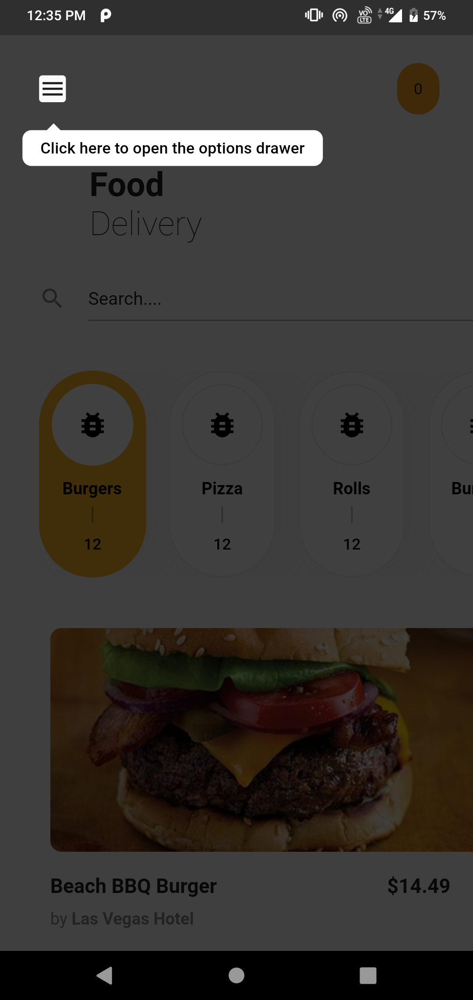
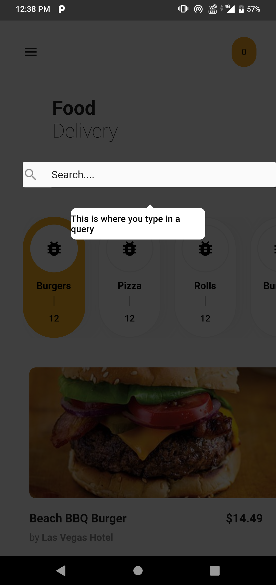

# Showcase View In Flutter

Guide your users efficiently through a complicated UI using the Showcase View Widget and make your application user friendly.

**[CLICK HERE](https://www.youtube.com/watch?v=DM4zorit1so)** : To checkout the Video.

**[CLICK HERE](https://www.youtube.com/watch?v=wWH66F9y63U)** : To checkout the UI Tutorial.

## Screenshots

